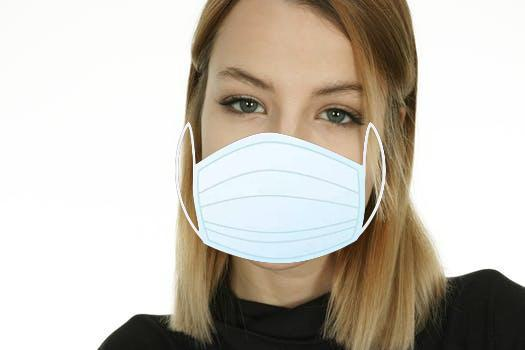
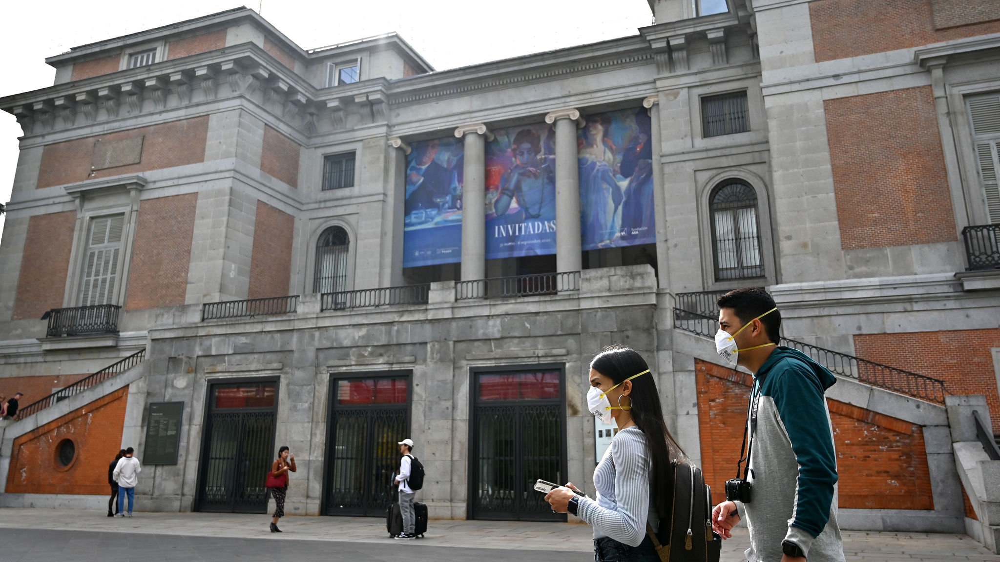
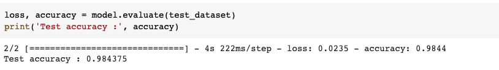
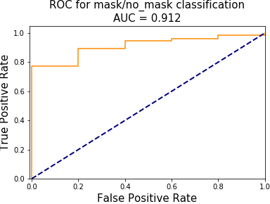
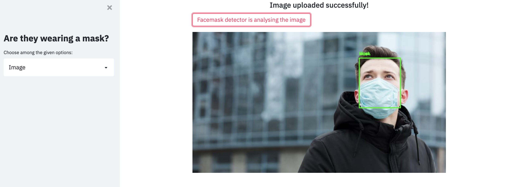
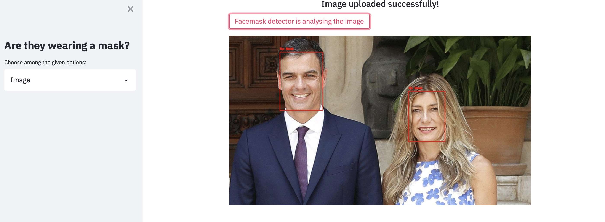
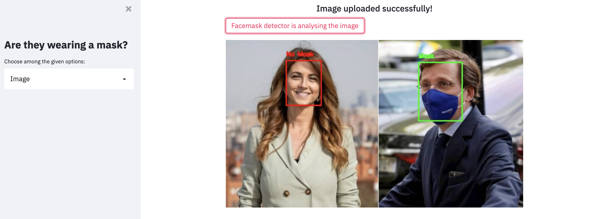
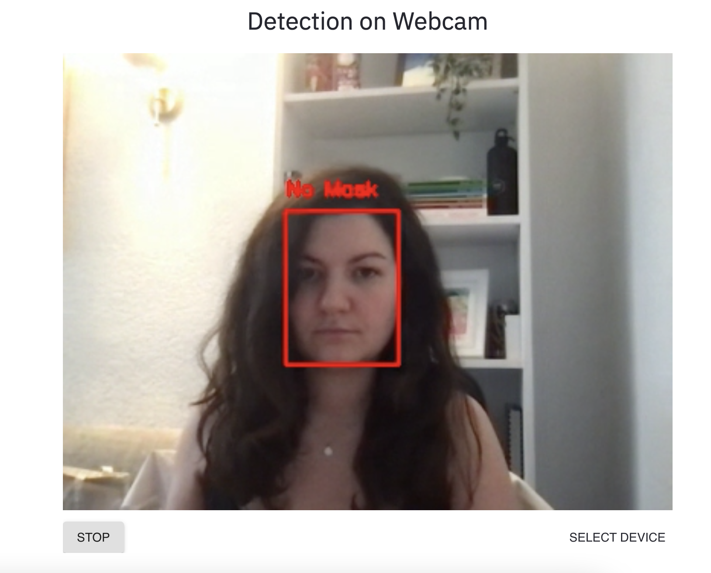
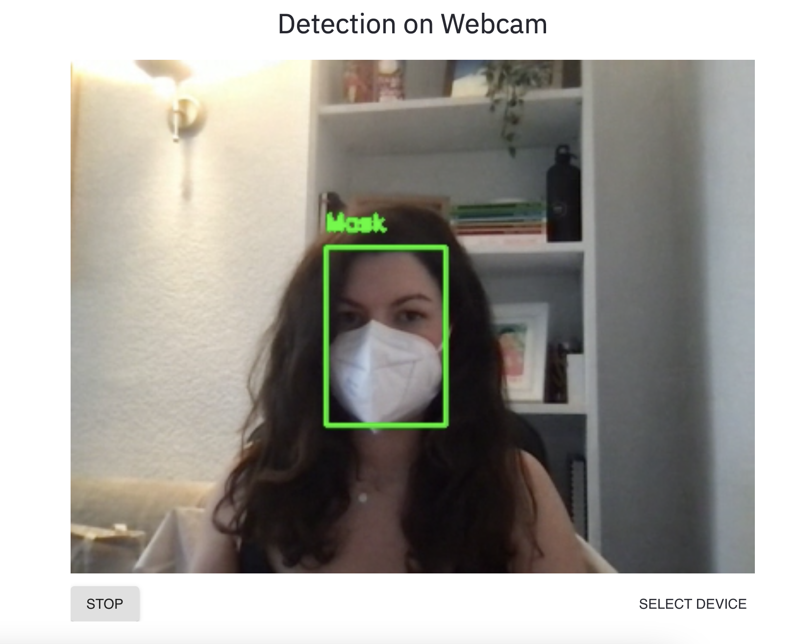

# Face-Mask Detection :mask:

[](https://www.linkedin.com/in/marinafernandezbanda/)


<p align="middle">
    
    
    
### :woman_technologist: Introduction

In the COVID-19 crisis wearing masks is absolutely necessary for public health and in terms of controlling the spread of the pandemic. 
This project's aim is to develop a system that could detect masked and unmasked faces in images and real-time video. This can, for example, be used to alert people that do not wear a mask when using the public transport, airports or in a theatre.


### :raising_hand: Project Workflow 

Our pipeline consists of three steps:
  1. An AI model which detect all human faces in an image.
  2. An AI model which predict if that face wears mask/no_mask.
  3. The output is an annotated image with the prediction.
  
  
### 🚀 Model's performance

The face-mask model is trained with 900 images but in order to increase their volume it was used data augmentation and the weights of the MobileNetV2 model. More about this architecture can be found [here](https://arxiv.org/pdf/1801.04381.pdf). 

The facemask model has an accuracy of 98% and a AUC of 91%.

<p align="middle">
    
    

## :star: Streamlit app

Face Mask Detector with images and video using Tensorflow & Streamlit Webrtc

command
```
$ streamlit run app.py 
```

**IMAGES**
<p align="middle">
    
    
    


**VIDEO**
<p align="middle">
    
    


## :warning: Technology Stack

- OpenCV
- Caffe-based face detector
- Keras
- TensorFlow
- MobileNetV2
- Streamlit & Streamlit Webrtc


## :open_file_folder: Folder Structure

``` 
└── final_project
    ├── css
    │   └── styles.css
    ├── face_detector
    │	├── deploy.prototxt
    │	└── res10_300x300_ssd_iter_140000.caffemodel
    ├── images_test
    ├── notebooks
    ├── plots
    ├── .gitignore
    ├── README.md
    ├── app.py
    ├── facemask_detector.py
    ├── mask_detector_video.py
    └── requirements.txt

```


## :eyes: Next Steps

- Upload the streamlit ad-hoc app to Amazon Web Services. 
- Keep improving the performance of face and face-mask AI model. 
- Keep improving the detection of faces with low light and low quality pictures/webcams.


## :mailbox: Contact info

For questions, suggestions and other inquiries... ping me [here](m.fernandezban@gmail.com).


